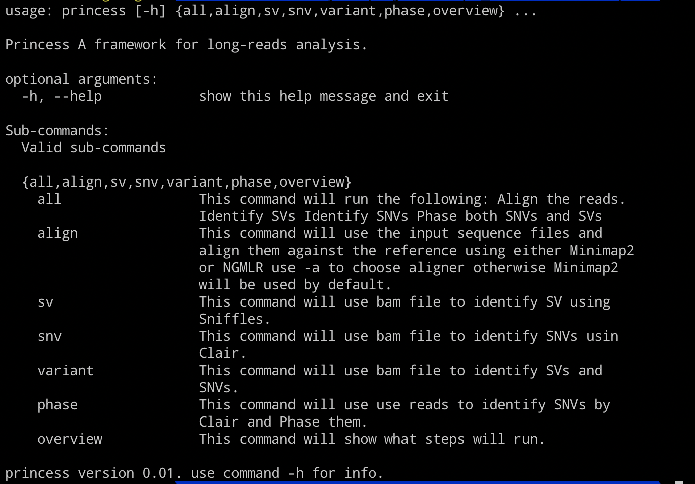
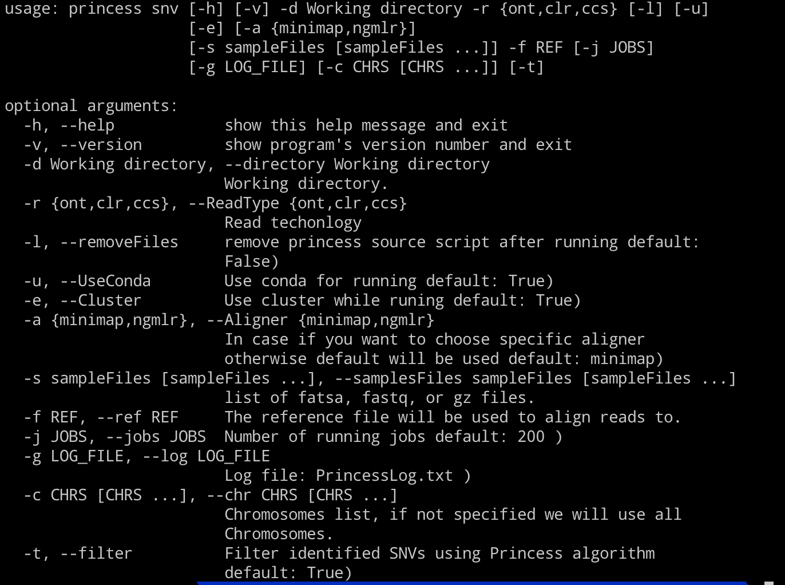

# Princess (beta version)
Princess is a fast and scalable framework to detect and report haplotype resolved Single Nucleotide Variants (SNV) and Structural Variations (SVs) at scale. It can leverage your cluster environment to speed up the detection which starts with one or many fasta or fastq files.

## Princess

* __Mapping__:  NGMLR or Minimap2
* __SNVs__: Clair (successor of Clairvoyante)
* __SVs__: Sniffles
* __Phasing SNVs__: WhatsHap
* __Phasing SVs__: PRINCESS-subtool
* __Extend Phasing__: PRINCESS-subtool
* __Phased Methylation__: Nanopolish + PRINCESS-subtool
* __QC Statistics__ for each step

## Installation
Princess was tested on CentOS release 6.7, Conda version 4.7.12 is installed:
for more information about [Installing Conda press here](https://bioconda.github.io/user/install.html#install-conda, "Install Conda")
To download same Conda version [here](https://repo.continuum.io/miniconda/Miniconda3-4.7.12-Linux-x86_64.sh "Conda 4.7.12")*

1. After conda is installed. Snakemake should be installed
~~~
conda install snakemake=5.7.1
~~~
2. Downloading PRINCESS  
~~~
git clone https://github.com/MeHelmy/princess.git
~~~
3. Install Clair, Training models, pypy, and intervaltree
~~~
cd princess
chmod +x install.sh
./install.sh
~~~

## Tutorial
To have an overview about princess write command `princess -h`.
You will have the following list of commands that we can use in princess.

Assume that we want only to run `snv` command, to know more about its option:

`princess snv -h`

So let's assume that we want to run all the analysis the comand shall be:

~~~
princess all  -d ./princess_all -r ont -s reads.split00.fastq.gz reads.split01.fastq.gz  -f hs37d5_mainchr.fa
~~~

`-r` defines the reads type.  
`-s` samples that we would like to analyze.  
`-f` **full path** to the reference.  

*__Note__*  
I am assuming that the reference file is indexed, if not please use the following command.  
`samtools faidx hs37d5_mainchr.fa` as a result you will have `hs37d5_mainchr.fa.fai`.

Done!!

## Output

Princess will create these directories:
- align   contains directory [minimap or ngmlr] based on the aligner that was specified.
- sv      contains the structural variant file sv/minimap/sniffles.vcf
- snp     contains single nucleotide variant calls per chromosomes
- phased  contains phased variant
- stat    contains Statistics
- meth    contains methylation info (if user choose to run methylation)      
